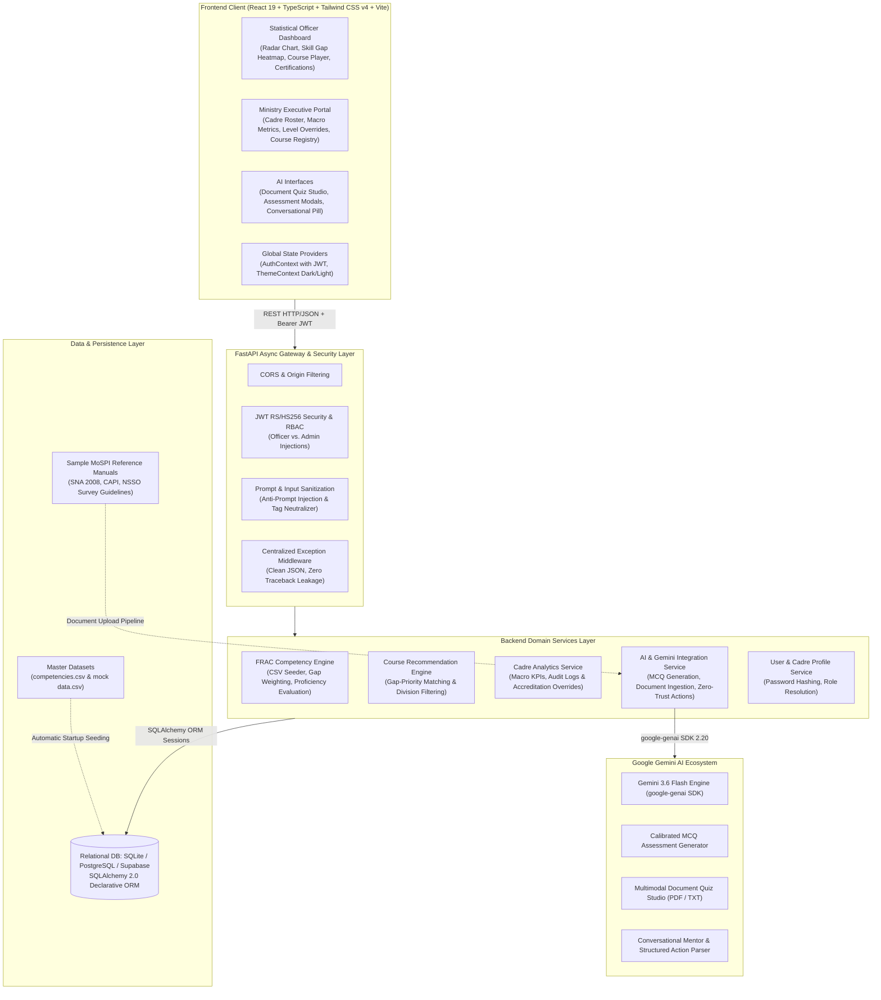
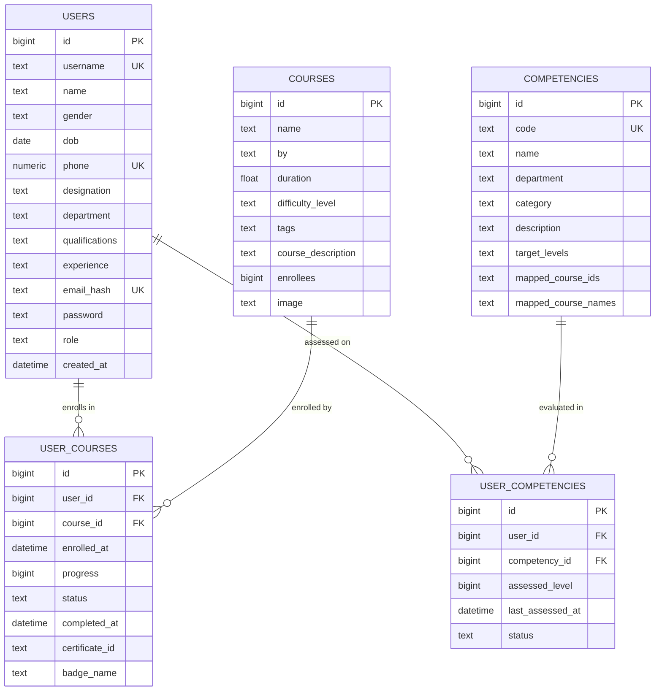

# MoSPI Skill Intelligence & Competency Development Platform
### Smart India Hackathon (SIH 2026) | Mission Karmayogi & NSSTA-TPAC Aligned

[](https://fastapi.tiangolo.com)
[](https://www.python.org)
[](https://react.dev)
[](https://www.typescriptlang.org)
[](https://tailwindcss.com)
[](https://vitejs.dev)
[](https://www.sqlalchemy.org)
[](https://ai.google.dev)
[](LICENSE)

An end-to-end, AI-powered competency management, skill gap analytics, and adaptive capacity-building ecosystem designed and built for the **Ministry of Statistics and Programme Implementation (MoSPI)**, Government of India, State Directorates of Economics & Statistics (DES), and Indian Statistical cadres (**Indian Statistical Service - ISS, Subordinate Statistical Service - SSS, and Field Officers**).

The platform is strictly architected around **Mission Karmayogi**, the **iGOT Karmayogi** standard, the **NSSTA-TPAC** (National Statistical Systems Training Academy - Training Policy & Action Committee) framework, and the **FRAC** (Framework for Roles, Activities, and Competencies) model.

---

## Table of Contents

- [Overview & Problem Statement](#overview--problem-statement)
- [High-Level System Architecture](#high-level-system-architecture)
- [Detailed Technical Stack](#detailed-technical-stack)
- [Core Functional Modules](#core-functional-modules)
  - [1. Statistical Officer Portal](#1-statistical-officer-portal)
  - [2. AI Competency Assessment Engine](#2-ai-competency-assessment-engine)
  - [3. AI Multimodal Document-to-Quiz Studio](#3-ai-multimodal-document-to-quiz-studio)
  - [4. AI Conversational Mentor & Zero-Trust Action Engine](#4-ai-conversational-mentor--zero-trust-action-engine)
  - [5. Ministry Executive & Cadre Admin Portal](#5-ministry-executive--cadre-admin-portal)
  - [6. Verifiable Digital Credentials & Registry](#6-verifiable-digital-credentials--registry)
- [Database Schema & Entity Architecture](#database-schema--entity-architecture)
- [Directory Structure](#directory-structure)
- [Getting Started](#getting-started)
  - [Prerequisites](#prerequisites)
  - [Backend Setup](#backend-setup)
  - [Frontend Setup](#frontend-setup)
  - [Environment Variables](#environment-variables)
- [API Reference](#api-reference)
  - [Auth & User Management (`/api/v1/auth`, `/api/v1/users`)](#auth--user-management-apiv1auth-apiv1users)
  - [Competencies & FRAC Matrix (`/api/v1/competencies`)](#competencies--frac-matrix-apiv1competencies)
  - [Courses & Learning Tracks (`/api/v1/courses`)](#courses--learning-tracks-apiv1courses)
  - [AI Engine & Document Studio (`/api/v1/ai`)](#ai-engine--document-studio-apiv1ai)
  - [Executive Administration (`/api/v1/admin`)](#executive-administration-apiv1admin)
  - [System Health (`/api/v1/health`)](#system-health-apiv1health)
- [Sample Learning Materials](#sample-learning-materials)
- [Security & Governance](#security--governance)
- [License](#license)

---

## Overview & Problem Statement

Modernizing capacity building across India's Official Statistical System demands shifting from generic, rule-based training to an **intelligent, competency-driven learning ecosystem**:

1. **FRAC Competency Alignment**: Mapping every official's role against national benchmark proficiency levels (L1 Foundation to L5 Expert) across **Domain**, **Functional**, and **Behavioural** dimensions for all MoSPI divisions (*National Accounts Division - NAD, Price Statistics Division - PSD, Field Operations Division - FOD, Survey Design and Research Division - SDRD, Data Quality Assurance Division - DQAD, Economic Statistics Division - ESD, Social Statistics Division - SSD, and Statistical Business Register - SBR*).
2. **Real-Time Skill Gap Analytics**: Dynamic mathematical gap computation between baseline/assessed proficiencies and cadre targets:
   $$\text{Gap} = \max(0, \text{Target Level} - \text{Assessed Level})$$
3. **AI-Driven Assessment & Mentorship**: Dynamic MCQ generation tailored to competency descriptors and live uploaded MoSPI/NSSO methodology manuals via **Google Gemini 3.6 Flash**.
4. **Actionable Executive Oversight**: Real-time cadre readiness metrics, departmental compliance tracking, urgency-weighted gap filters, and manual accreditation tools for NSSTA administrators.

---

## High-Level System Architecture



---

## Detailed Technical Stack

### Backend Stack
- **Language & Runtime**: Python 3.11 / 3.12 / 3.13
- **Web Framework**: [FastAPI](https://fastapi.tiangolo.com/) (v0.141.1) + [Starlette](https://www.starlette.io/) (v1.6.0)
- **ASGI Server**: [Uvicorn](https://www.uvicorn.org/) (v0.52.4) with auto-reloading and standard workers
- **Data Validation & Settings**: [Pydantic v2](https://docs.pydantic.dev/) (v2.13.4) & [Pydantic Settings](https://docs.pydantic.dev/latest/concepts/pydantic_settings/) (v2.15.0)
- **ORM & Database Toolkit**: [SQLAlchemy 2.0](https://www.sqlalchemy.org/) (v2.0.52) with declarative mapped types and relationship cascades
- **Database Engine Support**:
  - SQLite (Zero-config local file: `sih2026.db`)
  - PostgreSQL / Supabase (`psycopg2-binary`, `supabase` client v2.31.0)
- **AI & LLM Integration**: [Google GenAI Python SDK](https://github.com/google/generative-ai-python) (`google-genai` v2.20.0)
  - Primary Model: `gemini-3.6-flash`
  - Structured output schemas with strict Pydantic parsing
- **Authentication & Security**:
  - JSON Web Tokens via `PyJWT` (v2.13.0) with configurable expiration
  - Password hashing with SHA-256 / PBKDF2 / Bcrypt algorithms
  - Role-Based Access Control (RBAC) separating `officer` and `admin` roles
  - Custom input sanitizer protecting LLM prompts against prompt injection and delimiter tampering
- **File Handling**: `python-multipart` (v0.0.32) for document uploads (`.pdf`, `.txt`, `.docx`)

### Frontend Stack
- **Core Library**: [React 19](https://react.dev/) (v19.2.8) + [React DOM](https://react.dev/) (v19.2.8)
- **Language**: [TypeScript](https://www.typescriptlang.org/) (v6.0.2) with strict type checking
- **Build Tool & Bundler**: [Vite 8](https://vitejs.dev/) (v8.2.2) with `@vitejs/plugin-react`
- **Styling & Design System**: [Tailwind CSS v4](https://tailwindcss.com/) (`@tailwindcss/vite` v4.3.3)
- **Routing**: [React Router DOM v7](https://reactrouter.com/) (v7.18.2) with protected and role-guarded routes
- **Icons**: [Lucide React](https://lucide.dev/) (v1.35.0)
- **Visual Effects & Export Tools**:
  - `canvas-confetti` (v1.9.4) for course completion celebration overlays
  - `html-to-image` (v1.11.13) for client-side verifiable PNG certificate generation
- **Custom Charts**: Pure SVG-based interactive **Radar Chart** with multi-axis polygon overlays and dynamic tooltips

---

## Core Functional Modules

### 1. Statistical Officer Portal
- **Interactive FRAC Competency Radar Chart**: Mathematical radar polygon mapping current assessed proficiency levels against designation benchmarks across all mapped competencies.
- **Skill Gap Heatmap**: Color-coded matrix categorizing competencies into **Domain**, **Functional**, and **Behavioural** domains with visual gap indicators ($L_{\text{target}} - L_{\text{assessed}}$).
- **Personalized Course Recommendations**: Intelligently matches official courses from the iGOT/NSSTA catalog to competencies where the official exhibits the highest deficiency.
- **Interactive Course Player**: Step-by-step progress tracking (0% to 100%), video/module simulation, and milestone recording.
- **Dark / Light Mode**: Unified theme engine supporting daylight field operations and low-light workstation environments.

### 2. AI Competency Assessment Engine
- Powered by **Google Gemini 3.6 Flash** via `google-genai`.
- Dynamically creates 5 calibrated Multiple-Choice Questions (MCQs) tailored to specific competency definitions, MoSPI divisions, and target proficiency levels (L1–L5).
- Calibrated question taxonomy:
  - **L1 (Foundation)**: Conceptual definitions, terminology, core statistical laws.
  - **L2 (Intermediate)**: Direct workflow applications, formula calculations, survey protocols.
  - **L3–L4 (Advanced / Expert)**: Real-world trade-off analysis, edge-case troubleshooting, national account reconciliation.
- Upon quiz submission, the officer's live proficiency score updates in real-time with comprehensive distractor explanations.

### 3. AI Multimodal Document-to-Quiz Studio
- Officers and trainers can upload official MoSPI methodology manuals, NSSO guidelines, or policy circulars (`.pdf`, `.txt`, `.docx`).
- Automatically extracts foundational statistical principles and generates a verifiable, multi-difficulty assessment.
- Timed examination mode with instantaneous scoring, review, and feedback analysis.

### 4. AI Conversational Mentor & Zero-Trust Action Engine
- Embedded conversational AI grounded with full context of the officer's profile, designated cadre, active skill gaps, enrolled courses, and past quiz performance.
- **Zero-Trust Action Protocol**: When an officer requests enrollment in a recommended course via chat (e.g. *"Enroll me in the SNA 2008 National Accounts course"*), Gemini generates a structured `<ACTION>` tag:
  ```xml
  <ACTION>{"type": "ENROLL_COURSE", "course_id": 14}</ACTION>
  ```
  The backend parses, cryptographically validates, and safely executes the enrollment, returning updated state to the user.

### 5. Ministry Executive & Cadre Admin Portal
- **Macro Competency Health Index**: Aggregated metrics across all registered officers, average competency score, department-wise compliance, and completion rates.
- **Cadre Officer Roster**: Filterable roster supporting multi-cadre segregation (*ISS, SSS, DES*), division filtering (*NAD, FOD, PSD, DQAD, SDRD, ESD*), and gap status (*Urgent Gaps, Gaps Only, Target Achieved*).
- **Detailed Officer Drilldown**: In-depth view of any official's complete FRAC matrix, historical assessment attempts, and enrolled course history.
- **Manual Accreditation & Level Overrides**: Authorized administrative ability to adjust competency ratings with mandatory administrative remark logging.
- **Course Catalog Management**: Create, edit, and map new courses to FRAC competency codes.

### 6. Verifiable Digital Credentials & Registry
- Auto-generates unique cryptographic certificate IDs (e.g., `MOSPI-KARM-2026-XXXX`) upon reaching 100% course completion.
- High-fidelity digital certificate modal with Gold / Silver badge accreditation.
- Client-side high-resolution PNG export powered by `html-to-image`.
- Centralized Admin Verification Registry for national audit and cadre record tracking.

---

## Database Schema & Entity Architecture



---

## Directory Structure

```text
SIH 2026/
├── backend/
│   ├── app/
│   │   ├── api/
│   │   │   └── v1/
│   │   │       ├── admin.py           # Cadre roster, macro KPIs, overrides & cert registry
│   │   │       ├── ai.py              # Gemini quiz generation, document studio & AI chat
│   │   │       ├── api.py             # Main v1 API router aggregation
│   │   │       ├── competencies.py    # FRAC competency matrix & assessment scoring
│   │   │       ├── courses.py         # Course catalog, recommendations & progress tracking
│   │   │       ├── health.py          # System health check endpoints
│   │   │       └── users.py           # Authentication, registration & officer profiles
│   │   ├── core/
│   │   │   ├── config.py              # Pydantic Settings & environment variables
│   │   │   ├── dependencies.py        # JWT authentication & RBAC dependency injection
│   │   │   └── security.py            # Password hashing, verification & token minting
│   │   ├── data/
│   │   │   ├── competencies.csv       # MoSPI FRAC competency master matrix dataset
│   │   │   └── mock data.csv          # iGOT/NSSTA course catalog seed dataset
│   │   ├── db/
│   │   │   ├── init_db.py             # Schema creation & automated CSV database seeder
│   │   │   ├── schema.py              # SQLAlchemy 2.0 Declarative ORM Models
│   │   │   └── session.py             # Database engine & session maker
│   │   ├── models/                    # Domain model definitions
│   │   │   ├── course.py              # Course model definitions
│   │   │   └── user.py                # User model definitions
│   │   ├── schemas/                   # Pydantic request & response validation schemas
│   │   │   ├── admin.py               # Admin metrics & roster schemas
│   │   │   ├── ai.py                  # AI quiz, chat & document schemas
│   │   │   ├── competency.py          # Matrix & assessment schemas
│   │   │   ├── course.py              # Course recommendation & progress schemas
│   │   │   └── user.py                # User registration, login & profile schemas
│   │   ├── services/                  # Business logic & external service integrations
│   │   │   ├── admin.py               # Cadre analytics, metrics aggregation & overrides
│   │   │   ├── ai.py                  # Gemini MCQ assessment & document quiz engine
│   │   │   ├── ai_chat.py             # AI conversational mentor & zero-trust action engine
│   │   │   ├── competencies.py        # FRAC matrix computation & gap evaluation
│   │   │   ├── courses.py             # Gap-weighted course recommendation logic
│   │   │   └── users.py               # User authentication & registration handling
│   │   └── main.py                    # FastAPI application initialization & middleware
│   ├── requirements.txt               # Backend Python dependency specifications
│   └── .env.example                   # Environment configuration template
├── frontend/
│   ├── src/
│   │   ├── assets/                    # Static images, emblem & MoSPI logos
│   │   ├── components/                # Modular UI React components
│   │   │   ├── AIChatPill.tsx         # Floating conversational AI mentor with action drawer
│   │   │   ├── AssessmentQuizModal.tsx# Interactive 5-question competency quiz modal
│   │   │   ├── CertificateModal.tsx   # Verifiable digital credential viewer & PNG exporter
│   │   │   ├── CompetencyRadarChart.tsx# Pure SVG multi-axis dynamic Radar Chart
│   │   │   ├── CourseCompletionCelebrationModal.tsx # Confetti celebration modal
│   │   │   ├── DocumentQuizGeneratorModal.tsx # Multimodal document uploader modal
│   │   │   ├── DocumentQuizStudio.tsx # Interactive document quiz studio
│   │   │   ├── EnrollmentModal.tsx    # Course enrollment confirmation modal
│   │   │   ├── ExperienceInput.tsx    # Dynamic experience list form component
│   │   │   ├── QualificationsInput.tsx# Dynamic qualifications form component
│   │   │   ├── SkillGapHeatmap.tsx    # Heatmap visualizer for competency gaps
│   │   │   └── ThemeToggle.tsx        # Dark / Light theme switch button
│   │   ├── context/
│   │   │   ├── AuthContext.tsx        # Global JWT authentication & user session state
│   │   │   └── ThemeContext.tsx       # Global theme provider (Dark / Light)
│   │   ├── pages/
│   │   │   ├── AdminDashboard.tsx     # Ministry Executive & Cadre Management Dashboard
│   │   │   ├── Dashboard.tsx          # Statistical Officer Portal & Learning Hub
│   │   │   ├── Login.tsx              # Official login portal
│   │   │   └── Register.tsx           # Officer onboarding & cadre profile setup
│   │   ├── services/                  # Type-safe frontend API client modules
│   │   │   ├── admin.ts               # Admin metrics & roster API calls
│   │   │   ├── ai.ts                  # AI assessment, document quiz & chat API calls
│   │   │   ├── api.ts                 # Base Axios/Fetch client configuration
│   │   │   ├── auth.ts                # Login, registration & user profile API calls
│   │   │   ├── competencies.ts        # FRAC matrix & assessment API calls
│   │   │   └── courses.ts             # Course recommendations & enrollment API calls
│   │   ├── App.css                    # Application layout styles
│   │   ├── App.tsx                    # Route definitions, guards & layout
│   │   ├── index.css                  # Tailwind CSS v4 directives & root theme vars
│   │   └── main.tsx                   # React root entry point
│   ├── package.json                   # Frontend dependencies & npm scripts
│   ├── tailwind.config.js             # Tailwind CSS configuration
│   ├── tsconfig.json                  # TypeScript compiler configuration
│   └── vite.config.ts                 # Vite build & plugin configuration
├── sample_documents/                  # MoSPI reference documents for document studio
│   ├── MoSPI_GDP_Estimation_Methodology.txt # National Accounts reference doc
│   └── NSSO_Field_Survey_Methodology.txt    # NSSO sampling & field survey reference doc
├── LICENSE                            # MIT License
└── README.md                          # Comprehensive project documentation
```

---

## Getting Started

### Prerequisites

- **Python**: Version `3.11` or higher
- **Node.js**: Version `20.x` or higher (with `npm` or `pnpm`)
- **Google Gemini API Key**: Obtain a key from [Google AI Studio](https://aistudio.google.com/)

---

### Backend Setup

1. **Navigate to the backend directory**:
   ```bash
   cd backend
   ```

2. **Create and activate a virtual environment**:
   - **Linux / macOS**:
     ```bash
     python3 -m venv venv
     source venv/bin/activate
     ```
   - **Windows (PowerShell)**:
     ```powershell
     python -m venv venv
     .\venv\Scripts\Activate.ps1
     ```

3. **Install Python dependencies**:
   ```bash
   pip install -r requirements.txt
   ```

4. **Set up your environment variables**:
   ```bash
   cp .env.example .env
   ```
   Edit `.env` and provide your `GEMINI_API_KEY`:
   ```env
   GEMINI_API_KEY="your_actual_gemini_api_key"
   DATABASE_URL="sqlite:///./sih2026.db"
   APP_SECRET_KEY="super-secret-key-change-in-production"
   ```

5. **Run the FastAPI server**:
   ```bash
   uvicorn app.main:app --reload --host 0.0.0.0 --port 8000
   ```
   *The database schema and initial FRAC competency & course catalog will automatically seed on startup.*

---

### Frontend Setup

1. **Navigate to the frontend directory**:
   ```bash
   cd frontend
   ```

2. **Install Node dependencies**:
   ```bash
   npm install
   ```

3. **Start the Vite development server**:
   ```bash
   npm run dev
   ```

4. **Access the application**:
   - **Frontend Application**: [http://localhost:5173](http://localhost:5173)
   - **FastAPI Interactive Docs (Swagger)**: [http://localhost:8000/docs](http://localhost:8000/docs)
   - **FastAPI ReDoc Documentation**: [http://localhost:8000/redoc](http://localhost:8000/redoc)

---

### Environment Variables

| Variable | Type | Default | Description |
| :--- | :--- | :--- | :--- |
| `APP_NAME` | String | `SIH 2026 API` | Name of the FastAPI application |
| `APP_VERSION` | String | `1.0.0` | API version string |
| `DEBUG` | Boolean | `true` | Enables Swagger `/docs` and debug logs |
| `ENVIRONMENT` | String | `development` | Runtime environment (`development` / `production`) |
| `HOST` | String | `0.0.0.0` | Server host binding |
| `PORT` | Integer | `8000` | Server port binding |
| `DATABASE_URL` | String | `sqlite:///./sih2026.db` | SQLAlchemy connection URI (SQLite / PostgreSQL) |
| `SUPABASE_URL` | String | *None* | Optional Supabase PostgreSQL connection URI |
| `GEMINI_API_KEY` | String | *Required* | API key for Gemini 3.6 Flash models |
| `APP_SECRET_KEY` | String | `your-secret-key` | Cryptographic secret for signing JWTs |
| `ALGORITHM` | String | `HS256` | JWT signing algorithm |
| `ACCESS_TOKEN_EXPIRE_MINUTES` | Integer | `10080` (7 days) | Expiration time for JWT access tokens |
| `REFRESH_TOKEN_EXPIRE_DAYS` | Integer | `7` | Refresh token duration in days |
| `CORS_ORIGINS` | JSON Array | `["http://localhost:5173", ...]` | Allowed origins for CORS policy |

---

## API Reference

### Auth & User Management (`/api/v1/auth`, `/api/v1/users`)

| Method | Endpoint | Description | Auth Required |
| :--- | :--- | :--- | :--- |
| `POST` | `/api/v1/users/register` | Register a new statistical officer or admin | No |
| `POST` | `/api/v1/users/login` | Authenticate using username/email/phone & receive JWT | No |
| `GET` | `/api/v1/users/me` | Fetch authenticated officer profile and cadre info | Yes (Bearer) |
| `GET` | `/api/v1/users/check-username` | Verify if a username is available | No |
| `GET` | `/api/v1/users/all` | List all registered officers (Admin restricted) | Yes (Admin) |

### Competencies & FRAC Matrix (`/api/v1/competencies`)

| Method | Endpoint | Description | Auth Required |
| :--- | :--- | :--- | :--- |
| `GET` | `/api/v1/competencies/matrix` | Retrieve personalized FRAC matrix, benchmark levels & gaps | Yes (Bearer) |
| `POST` | `/api/v1/competencies/assess` | Submit assessment score to update official competency level | Yes (Bearer) |
| `GET` | `/api/v1/competencies/all` | List master competency catalog across all MoSPI divisions | Yes (Bearer) |

### Courses & Learning Tracks (`/api/v1/courses`)

| Method | Endpoint | Description | Auth Required |
| :--- | :--- | :--- | :--- |
| `GET` | `/api/v1/courses/recommendations` | Retrieve gap-weighted personalized course recommendations | Yes (Bearer) |
| `POST` | `/api/v1/courses/{id}/enroll` | Enroll the authenticated officer in a course | Yes (Bearer) |
| `GET` | `/api/v1/courses/my-courses` | Retrieve enrolled courses with progress percentages | Yes (Bearer) |
| `PUT` | `/api/v1/courses/{id}/progress` | Update course progress percentage (0-100) | Yes (Bearer) |
| `POST` | `/api/v1/courses/{id}/complete` | Mark course complete & mint verifiable digital certificate | Yes (Bearer) |
| `GET` | `/api/v1/courses/all` | Retrieve the complete iGOT/NSSTA course catalog | Yes (Bearer) |

### AI Engine & Document Studio (`/api/v1/ai`)

| Method | Endpoint | Description | Auth Required |
| :--- | :--- | :--- | :--- |
| `GET` | `/api/v1/ai/getquiz` | Generate calibrated 5-question MCQ competency quiz | Yes (Bearer) |
| `POST` | `/api/v1/ai/generate-document-quiz` | Upload document (`.pdf`, `.txt`) and generate contextual quiz | Yes (Bearer) |
| `POST` | `/api/v1/ai/chat` | Conversational mentor chat with zero-trust action execution | Yes (Bearer) |

### Executive Administration (`/api/v1/admin`)

| Method | Endpoint | Description | Auth Required |
| :--- | :--- | :--- | :--- |
| `GET` | `/api/v1/admin/summary` | Macro executive analytics, competency health index & KPIs | Yes (Admin) |
| `GET` | `/api/v1/admin/officers` | Cadre Officer Roster with search, division & gap filters | Yes (Admin) |
| `GET` | `/api/v1/admin/officers/{id}` | Full profile drilldown, competency matrix & history | Yes (Admin) |
| `POST` | `/api/v1/admin/officers/{id}/competencies` | Manual admin accreditation & level override | Yes (Admin) |
| `POST` | `/api/v1/admin/courses` | Create new course and map to FRAC competencies | Yes (Admin) |
| `PUT` | `/api/v1/admin/courses/{id}` | Update course metadata and competency mappings | Yes (Admin) |
| `GET` | `/api/v1/admin/certifications` | Digital credential registry and verification audit log | Yes (Admin) |

### System Health (`/api/v1/health`)

| Method | Endpoint | Description | Auth Required |
| :--- | :--- | :--- | :--- |
| `GET` | `/health` | Core system health check & version ping | No |
| `GET` | `/api/v1/health` | API v1 health check and database connectivity | No |

---

## Sample Learning Materials

Sample official methodology manuals are provided in the [`sample_documents/`](sample_documents/) directory for evaluating the **AI Document-to-Quiz Studio**:

1. **`MoSPI_GDP_Estimation_Methodology.txt`**: Standard Operating Procedures and estimation methodology for Gross Value Added (GVA), Gross Domestic Product (GDP), and System of National Accounts (SNA 2008).
2. **`NSSO_Field_Survey_Methodology.txt`**: Multi-stage stratified sampling design, Urban Frame Survey (UFS) listing, and Computer-Assisted Personal Interviewing (CAPI) field validation protocols.

---

## Security & Governance

- **Role-Based Access Control (RBAC)**: Enforced via FastAPI dependency injection separating statistical officers from ministry executive administrators.
- **Input Sanitization & Anti-Jailbreak**: All user queries and uploaded document texts are scrubbed against delimiter spoofing and prompt injection attacks before reaching LLMs.
- **Zero-Trust Action Verification**: The conversational AI mentor is constrained to safe, verified course enrollments only, preventing unauthorized record modification.
- **Cryptographic Certificate Verification**: Digital credentials include unique verifiable identifiers and badge stamps for auditing.
- **Data Privacy & Protection**: Passwords hashed with strong cryptographic salts; sensitive personal identifiers safely segregated.

---

## License

Distributed under the **MIT License**. See [`LICENSE`](LICENSE) for details.

---

<div align="center">
  <sub>Developed for <strong>Smart India Hackathon 2026</strong> | Ministry of Statistics and Programme Implementation (MoSPI)</sub>
</div>
