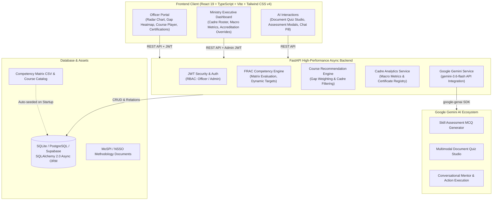

# MoSPI Skill Intelligence & Competency Development Platform
### Smart India Hackathon (SIH 2026) | Mission Karmayogi & NSSTA-TPAC Aligned

[](https://fastapi.tiangolo.com)
[](https://react.dev)
[](https://www.typescriptlang.org)
[](https://tailwindcss.com)
[](https://ai.google.dev)
[](LICENSE)

An intelligent, AI-powered competency management and personalized capacity-building platform developed for the **Ministry of Statistics and Programme Implementation (MoSPI)**, Government of India, State Directorates of Economics & Statistics (DES), and Indian Statistical cadres (**ISS, SSS, and Subordinate Statistical Officers**).

Built strictly in accordance with **Mission Karmayogi**, the **iGOT Karmayogi** platform specifications, the **NSSTA-TPAC** (National Statistical Systems Training Academy - Training Policy & Action Committee) framework, and the **FRAC** (Framework for Roles, Activities, and Competencies).

---

## Table of Contents

- [Key Highlights & Problem Statement](#-key-highlights--problem-statement)
- [System Architecture](#-system-architecture)
- [Core Features](#-core-features)
  - [1. Statistical Officer Portal](#1-statistical-officer-portal)
  - [2. AI Competency Assessment Engine](#2-ai-competency-assessment-engine)
  - [3. AI Document-to-Quiz Studio](#3-ai-document-to-quiz-studio)
  - [4. AI Learning Assistant & Competency Mentor](#4-ai-learning-assistant--competency-mentor)
  - [5. Ministry Executive & Cadre Admin Portal](#5-ministry-executive--cadre-admin-portal)
  - [6. Digital Credentials & Certificate Verification](#6-digital-credentials--certificate-verification)
- [Tech Stack](#-tech-stack)
- [Directory Structure](#-directory-structure)
- [Getting Started](#-getting-started)
  - [Prerequisites](#prerequisites)
  - [Backend Setup](#backend-setup)
  - [Frontend Setup](#frontend-setup)
  - [Environment Configuration](#environment-configuration)
- [API Reference](#-api-reference)
- [Sample Learning Materials](#-sample-learning-materials)
- [Security & Compliance](#-security--compliance)
- [License](#-license)

---

## Key Highlights & Problem Statement

Modernizing capacity building across India's Official Statistical System requires transitioning from rule-based training to a dynamic, competency-driven learning ecosystem:

1. **FRAC Competency Alignment**: Mapping individual officials against official benchmark competency levels across Domain, Functional, and Behavioural categories for all MoSPI divisions (*NAD, PSD, FOD, SDRD, DQAD, ESD, SSD, SBR*).
2. **Dynamic Skill Gap Analytics**: Instant identification of proficiency gaps between baseline evaluations and cadre targets (L1 Foundation to L5 Expert).
3. **AI-Driven Assessment & Mentorship**: Automated generation of contextual MCQs from competency metadata and live uploaded MoSPI/NSSO methodology manuals using **Google Gemini 3.6 Flash**.
4. **Actionable Executive Oversight**: Real-time cadre readiness metrics, departmental compliance tracking, urgency-weighted gap filters, and manual accreditation tools for training managers.

---

## System Architecture



---

## Core Features

### 1. Statistical Officer Portal
- **Interactive FRAC Competency Radar Chart**: Multidimensional visual representation comparing current assessed proficiency against cadre benchmarks.
- **Skill Gap Heatmap**: Color-coded breakdown across Domain, Functional, and Behavioural competencies highlighting critical growth areas.
- **Personalized Course Recommendations**: Algorithmic course matching prioritized based on specific competency deficiencies and official cadre requirements.
- **Interactive Course Player**: Module progression tracking, status management, and instant celebratory completion workflows.
- **Dark / Light Mode**: Unified theme toggle tailored for low-light desk work and field usage.

### 2. AI Competency Assessment Engine
- Powered by **Google Gemini 3.6 Flash** via the official `google-genai` SDK.
- Dynamically creates 5 calibrated Multiple-Choice Questions (MCQs) tailored to specific competency definitions, MoSPI divisions, and target proficiency levels (L1–L5).
- Provides detailed conceptual explanations and distractor analyses upon submission, automatically updating the officer's live FRAC matrix score.

### 3. AI Document-to-Quiz Studio
- Upload official MoSPI/NSSO manuals, survey guidelines, or policy documents (`.txt`, `.pdf`, `.docx`).
- Automatically extracts key statistical principles and generates verifiable multi-difficulty quizzes mapped to statistical competencies (e.g., SNA 2008, CAPI survey protocols, Consumer Price Indexing).
- Live interactive examination interface with timer, score tallying, and answer breakdown.

### 4. AI Learning Assistant & Competency Mentor
- Conversational assistant embedded directly into the officer interface.
- Grounded with live context: officer profile, competency gaps, course recommendations, and quiz performance.
- **Zero-Trust Action Protocol**: Capable of directly enrolling officers in recommended iGOT/NSSTA courses upon natural language request through strict structured action tags.
- Built-in prompt sanitization and anti-jailbreak defenses.

### 5. Ministry Executive & Cadre Admin Portal
- **Macro Competency Index**: Executive KPIs, average competency score, overall training completion rates, and active certifications.
- **Cadre Officer Roster**: Searchable and filterable cadre database by Cadre (*ISS, SSS, DES*), Division (*NAD, FOD, PSD, DQAD, SDRD, ESD*), and Gap Status (*Urgent Gaps, Gaps Only, Target Achieved*).
- **Officer Drilldown Profile**: Full competency breakdown, historical assessments, and course completion audit trail.
- **Manual Accreditation & Level Overrides**: Authorized admin capability to adjust official competency ratings with administrative audit remarks.
- **Course Catalog Management**: Add, update, and map courses to FRAC competency codes.

### 6. Digital Credentials & Certificate Verification
- Automatically issues verifiable digital certificates with unique cryptographic identifiers upon 100% course completion.
- High-fidelity visual certificate rendering with badge accreditation.
- One-click **Download as PNG** powered by `html-to-image` and instant celebration confetti animations.
- Centralized Admin Certification Registry for verification and auditing.

---

## Tech Stack

### Backend
- **Framework**: [FastAPI](https://fastapi.tiangolo.com/) (Python 3.11+)
- **ORM & Database**: [SQLAlchemy 2.0](https://www.sqlalchemy.org/) with [Pydantic v2](https://docs.pydantic.dev/)
- **Database Engine**: SQLite (default zero-config local) / PostgreSQL / Supabase compatible
- **AI Integration**: [Google GenAI SDK](https://github.com/google/generative-ai-python) (`gemini-3.6-flash`)
- **Authentication**: JWT (JSON Web Tokens) with `passlib[bcrypt]` / `hashlib`
- **Server**: [Uvicorn](https://www.uvicorn.org/) with hot-reloading

### Frontend
- **Framework**: [React 19](https://react.dev/) + [TypeScript 6](https://www.typescriptlang.org/)
- **Build Tool**: [Vite 8](https://vitejs.dev/)
- **Styling**: [Tailwind CSS v4](https://tailwindcss.com/)
- **Routing**: [React Router v7](https://reactrouter.com/)
- **Icons**: [Lucide React](https://lucide.dev/)
- **Visuals & Effects**: `canvas-confetti`, `html-to-image`

---

## Directory Structure

```text
SIH 2026/
├── backend/
│   ├── app/
│   │   ├── api/
│   │   │   └── v1/
│   │   │       ├── admin.py           # Admin cadre roster, metrics & overrides
│   │   │       ├── ai.py              # AI quiz & document studio endpoints
│   │   │       ├── api.py             # Main v1 API router aggregation
│   │   │       ├── competencies.py    # FRAC competency matrix & scoring
│   │   │       ├── courses.py         # Course recommendations & progress
│   │   │       ├── health.py          # Health check endpoints
│   │   │       └── users.py           # Auth, registration & officer profiles
│   │   ├── core/
│   │   │   ├── config.py              # Pydantic Settings & environment config
│   │   │   ├── dependencies.py        # JWT authentication & role dependencies
│   │   │   └── security.py            # Password hashing & token generation
│   │   ├── data/
│   │   │   ├── competencies.csv       # MoSPI FRAC competency master matrix
│   │   │   └── mock data.csv          # iGOT/NSSTA course catalog dataset
│   │   ├── db/
│   │   │   ├── init_db.py             # DB schema initialization & CSV seeder
│   │   │   ├── schema.py              # SQLAlchemy ORM declarative models
│   │   │   └── session.py             # Database engine & session maker
│   │   ├── schemas/                   # Pydantic validation & serialization models
│   │   ├── services/                  # Core domain logic & AI integration
│   │   │   ├── admin.py               # Administrative analytics & overrides
│   │   │   ├── ai.py                  # Gemini assessment & document quiz logic
│   │   │   ├── ai_chat.py             # Gemini conversational mentor & action parsing
│   │   │   ├── competencies.py        # FRAC matrix evaluation & gap analysis
│   │   │   └── courses.py             # Course recommendation algorithm
│   │   │   └── users.py               # User authentication & management
│   │   └── main.py                    # FastAPI application entry point
│   ├── requirements.txt               # Backend Python dependencies
│   └── .env.example                   # Environment configuration template
├── frontend/
│   ├── src/
│   │   ├── assets/                    # Static images and brand assets
│   │   ├── components/                # Modular UI components
│   │   │   ├── AIChatPill.tsx         # Floating conversational AI mentor
│   │   │   ├── AssessmentQuizModal.tsx# Interactive competency quiz modal
│   │   │   ├── CertificateModal.tsx   # Verified digital credential modal
│   │   │   ├── CompetencyRadarChart.tsx# SVG-based dynamic Radar Chart
│   │   │   ├── CourseCompletionCelebrationModal.tsx # Celebration overlay
│   │   │   ├── DocumentQuizGeneratorModal.tsx # File upload modal
│   │   │   ├── DocumentQuizStudio.tsx # Interactive document quiz assessment
│   │   │   ├── EnrollmentModal.tsx    # Course enrollment confirmation
│   │   │   ├── ExperienceInput.tsx    # Dynamic experience list form input
│   │   │   ├── QualificationsInput.tsx# Dynamic qualifications form input
│   │   │   ├── SkillGapHeatmap.tsx    # Heatmap visualizer for competency gaps
│   │   │   └── ThemeToggle.tsx        # Dark / Light theme switch
│   │   ├── context/
│   │   │   ├── AuthContext.tsx        # Global JWT auth & user state
│   │   │   └── ThemeContext.tsx       # Global theme state provider
│   │   ├── pages/
│   │   │   ├── AdminDashboard.tsx     # Ministry Executive Dashboard
│   │   │   ├── Dashboard.tsx          # Statistical Officer Dashboard
│   │   │   ├── Login.tsx              # Secure login portal
│   │   │   └── Register.tsx           # Officer registration & profile setup
│   │   ├── services/                  # Frontend API client modules
│   │   ├── App.tsx                    # Route definitions & guards
│   │   └── main.tsx                   # React root entry point
│   ├── package.json                   # Frontend dependencies & scripts
│   ├── tailwind.config.js / vite.config.ts # Build & styling configurations
│   └── tsconfig.json                  # TypeScript configuration
├── sample_documents/                  # Sample MoSPI reference material
│   ├── MoSPI_GDP_Estimation_Methodology.txt # National Accounts reference doc
│   └── NSSO_Field_Survey_Methodology.txt    # NSSO survey & sampling reference
├── LICENSE                            # MIT License
└── README.md                          # Project documentation
```

---

## Getting Started

### Prerequisites

- **Python**: Version `3.11` or higher
- **Node.js**: Version `20.x` or higher (with `npm` or `pnpm`)
- **Google Gemini API Key**: Obtain a free key from [Google AI Studio](https://aistudio.google.com/)

---

### Backend Setup

1. **Navigate to the backend directory**:
   ```bash
   cd backend
   ```

2. **Create and activate a virtual environment**:
   - **Linux / macOS**:
     ```bash
     python3 -m venv venv
     source venv/bin/activate
     ```
   - **Windows (PowerShell)**:
     ```powershell
     python -m venv venv
     .\venv\Scripts\Activate.ps1
     ```

3. **Install Python dependencies**:
   ```bash
   pip install -r requirements.txt
   ```

4. **Set up your environment variables**:
   ```bash
   cp .env.example .env
   ```
   Open `.env` and configure your `GEMINI_API_KEY`:
   ```env
   GEMINI_API_KEY="your_actual_gemini_api_key"
   DATABASE_URL="sqlite:///./sih2026.db"
   APP_SECRET_KEY="super-secret-key-for-jwt-generation"
   ```

5. **Run the FastAPI backend server**:
   ```bash
   uvicorn app.main:app --reload --host 0.0.0.0 --port 8000
   ```
   *The database schema and initial FRAC competency & course catalog will seed automatically on startup.*

---

### Frontend Setup

1. **Navigate to the frontend directory**:
   ```bash
   cd frontend
   ```

2. **Install Node dependencies**:
   ```bash
   npm install
   ```

3. **Start the Vite development server**:
   ```bash
   npm run dev
   ```

4. **Access the application**:
   - **Frontend UI**: [http://localhost:5173](http://localhost:5173)
   - **Backend Interactive API Docs (Swagger)**: [http://localhost:8000/docs](http://localhost:8000/docs)
   - **ReDoc Documentation**: [http://localhost:8000/redoc](http://localhost:8000/redoc)

---

### Environment Configuration

| Variable | Type | Default | Description |
| :--- | :--- | :--- | :--- |
| `APP_NAME` | String | `SIH 2026 API` | Title of the FastAPI application |
| `DEBUG` | Boolean | `true` | Enables Swagger `/docs` and debug logs |
| `HOST` | String | `0.0.0.0` | Server host binding |
| `PORT` | Integer | `8000` | Server port binding |
| `DATABASE_URL` | String | `sqlite:///./sih2026.db` | SQLAlchemy connection URI (SQLite / PostgreSQL) |
| `SUPABASE_URL` | String | *None* | Optional Supabase PostgreSQL connection URI |
| `GEMINI_API_KEY` | String | *Required* | API key for Gemini 3.6 Flash models |
| `APP_SECRET_KEY` | String | `your-secret-key` | Cryptographic secret for signing JWTs |
| `ACCESS_TOKEN_EXPIRE_MINUTES` | Integer | `10080` (7 days) | Expiration time for JWT access tokens |
| `CORS_ORIGINS` | JSON Array | `["http://localhost:5173", ...]` | Allowed origins for CORS policy |

---

## API Reference

### Authentication & Users (`/api/v1/auth`, `/api/v1/users`)
- `POST /api/v1/users/register` - Create a new statistical officer / admin account
- `POST /api/v1/users/login` - Authenticate using username/email/phone & receive JWT
- `GET /api/v1/users/me` - Fetch profile of currently authenticated user
- `GET /api/v1/users/check-username` - Validate availability of a username
- `GET /api/v1/users/all` - List all registered officers

### FRAC Competency Matrix (`/api/v1/competencies`)
- `GET /api/v1/competencies/matrix` - Retrieve user's personalized FRAC matrix, benchmark levels, and gaps
- `POST /api/v1/competencies/assess` - Submit assessment score to update competency level
- `GET /api/v1/competencies/all` - List all master competencies across MoSPI divisions

### Course Catalog & Learning (`/api/v1/courses`)
- `GET /api/v1/courses/recommendations` - Retrieve personalized, gap-weighted course recommendations
- `POST /api/v1/courses/{id}/enroll` - Enroll the authenticated officer in a course
- `GET /api/v1/courses/my-courses` - Retrieve officer's enrolled courses with progress
- `PUT /api/v1/courses/{id}/progress` - Update course progress percentage
- `POST /api/v1/courses/{id}/complete` - Mark course as completed and issue verifiable digital certificate
- `GET /api/v1/courses/all` - Retrieve the complete iGOT/NSSTA course catalog

### AI Assessment & Document Studio (`/api/v1/ai`)
- `GET /api/v1/ai/getquiz` - Generate calibrated 5-question MCQ competency quiz via Gemini
- `POST /api/v1/ai/generate-document-quiz` - Upload document (`.pdf`, `.txt`) and generate contextual quiz
- `POST /api/v1/ai/chat` - Chat with AI Mentor & execute zero-trust course enrollment actions

### Ministry Executive & Cadre Management (`/api/v1/admin`)
- `GET /api/v1/admin/summary` - Macro executive analytics, competency health index & gap distributions
- `GET /api/v1/admin/officers` - Cadre Officer Roster with search, division, cadre, and gap filters
- `GET /api/v1/admin/officers/{id}` - Full profile drilldown, competency matrix, and history
- `POST /api/v1/admin/officers/{id}/competencies` - Manual admin accreditation & level override
- `POST /api/v1/admin/courses` - Create new course and map to FRAC competencies
- `PUT /api/v1/admin/courses/{id}` - Update course metadata and competency tags
- `GET /api/v1/admin/certifications` - Digital credential registry and verification audit log

---

## Sample Learning Materials

Sample official methodology documents are included in the [`sample_documents/`](sample_documents/) directory for evaluating the **AI Document-to-Quiz Studio**:

1. **`MoSPI_GDP_Estimation_Methodology.txt`**: Standard Operating Procedures and estimation methodology for Gross Value Added (GVA), Gross Domestic Product (GDP), and System of National Accounts (SNA 2008).
2. **`NSSO_Field_Survey_Methodology.txt`**: Multi-stage stratified sampling design, Urban Frame Survey (UFS) listing, and Computer-Assisted Personal Interviewing (CAPI) field validation protocols.

---

## Security & Compliance

- **Role-Based Access Control (RBAC)**: Enforced via FastAPI dependency injection separating statistical officers from ministry executive administrators.
- **Input Sanitization & Anti-Jailbreak**: All user queries and uploaded document texts are scrubbed against delimiter spoofing and prompt injection attacks.
- **Zero-Trust Action Verification**: AI mentor is constrained to safe, verified course enrollments only, preventing unauthorized record modification.
- **Data Privacy**: Passwords hashed with strong cryptographic salts; sensitive identifiers safely segregated.

---

## License

Distributed under the **MIT License**. See [`LICENSE`](LICENSE) for more information.

---

<div align="center">
  <sub>Developed for <strong>Smart India Hackathon 2026</strong> | Ministry of Statistics and Programme Implementation (MoSPI)</sub>
</div>
