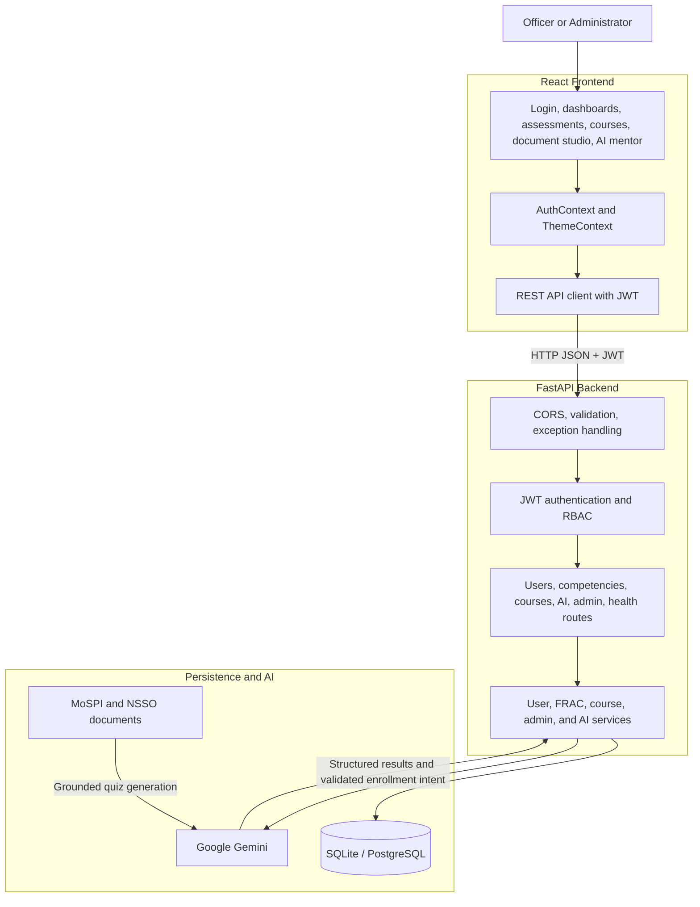
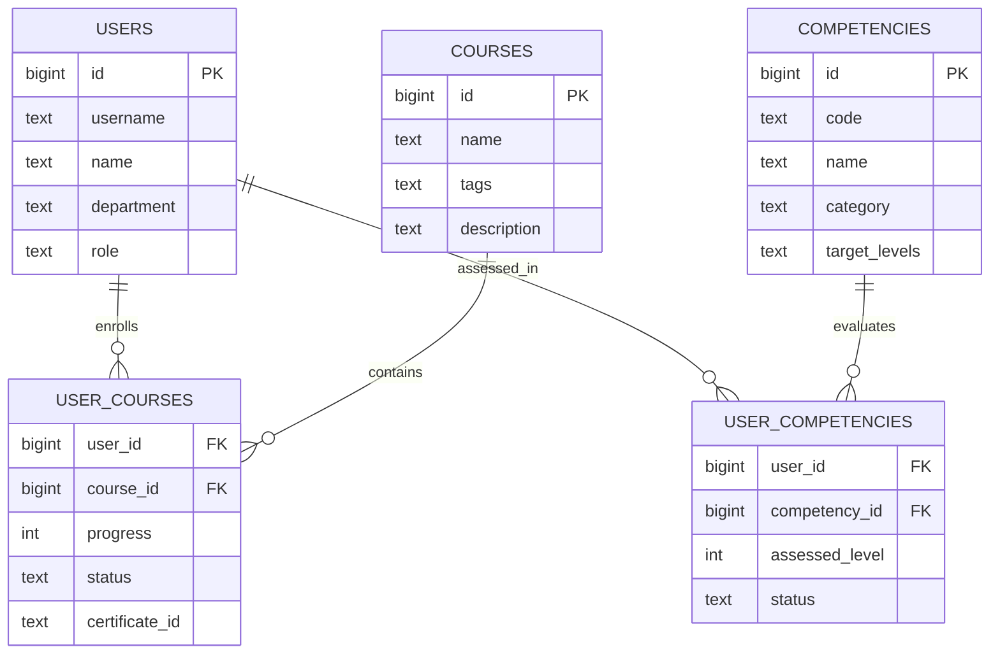

# Viksit System Architecture

Viksit is an AI-powered competency and learning platform for MoSPI statistical officers and administrators.

## High-Level Flow

```text
Officer / Administrator
          |
          v
React Frontend (Vite + TypeScript)
          | REST/JSON + JWT
          v
FastAPI Backend (/api/v1)
          |
          +--> Domain Services --> SQLAlchemy --> SQLite/PostgreSQL
          |    Users, competencies, courses, admin analytics
          |
          +--> Gemini AI
               Assessments, document quizzes, learning mentor
          |
          v
Personalized results, recommendations, progress, and certificates
          |
          v
React Dashboard, Admin Portal, and AI interfaces
```

## Components



## Main Data Flows

### Competency Assessment

1. The dashboard loads the officer's FRAC competency matrix and target levels.
2. The AI service sends competency context to Gemini and receives five structured MCQs.
3. The submitted assessment updates proficiency and dashboard visualizations.
4. Skill gaps are calculated as:

   $$\text{Gap} = \max(0, \text{Target Level} - \text{Assessed Level})$$

### Courses and Enrollment

1. Course recommendations are matched to the officer's largest competency gaps.
2. Enrollment and progress are stored in `user_courses`.
3. Completion records certificate and badge information.
4. The AI mentor may request enrollment, but the backend validates the course and action before writing data.

### Document Quizzes and AI Mentor

1. An officer or trainer uploads a MoSPI/NSSO PDF, TXT, or DOCX document.
2. Gemini generates a source-grounded quiz with options, answers, explanations, and competency tags.
3. The mentor receives sanitized profile, gap, course, quiz, and document context.
4. It provides learning guidance and can perform enrollment only through a server-validated action.

### Administration

Administrators use the protected admin portal to view cadre metrics, inspect officer competency gaps, manage courses, and apply competency overrides with remarks.

## Persistence Model



## API and Security

All application routes are under `/api/v1`:

| Route | Purpose |
| --- | --- |
| `/users`, `/auth` | Registration, login, and profiles |
| `/competencies` | FRAC matrix and assessments |
| `/courses` | Catalog, recommendations, enrollment, and progress |
| `/ai` | Gemini assessments, document quizzes, and mentor chat |
| `/admin` | Analytics, course management, and overrides |
| `/health` | Service health |

- JWT authentication and role-based access protect officer and administrator workflows.
- Pydantic validation and centralized exception handling keep API responses consistent.
- Prompts and uploaded content are sanitized before entering AI context.
- AI actions are restricted to enrollment and validated server-side.
